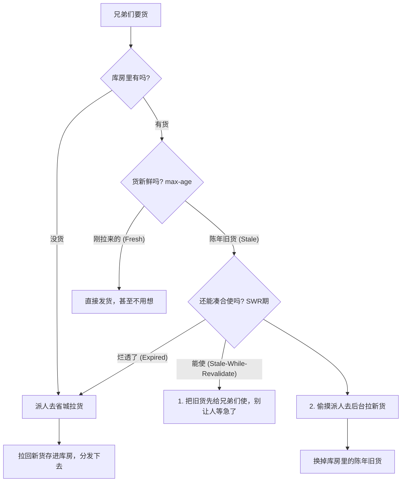

# 让缓存飞一会儿：Stale-while-revalidate (SWR)

张麻子：“师爷，你给翻译翻译，什么叫 Stale-while-revalidate？”  
师爷：“这还用翻译？就是东西虽然旧了点，但先给兄弟们使着，回头再换新的。”  
张麻子：“我问的是，什么叫、特么的、Stale-while-revalidate！”  
师爷：“核心就一句话：**让旧内容先飞一会儿，后台悄悄把新货补上。**”

## 鹅城的规矩：SWR 工作逻辑

在咱们 Web 界，高性能就是硬道理。SWR 策略，就是为了实现那“秒开”的境界。



## 关键机制：谁也别想看漏了

- **缓存命中 (Fresh)**：货很新鲜，直接使。这是最体面的，省时省力。
- **让缓存飞 (Stale)**：货虽然过了日期，但还在“通融期”内。用户拿走旧货，系统后台拉新货。**用户没等，货也更新了。**这就是公平！
- **彻底歇菜 (Expired)**：过了通融期，那就是真烂了。谁也救不了，老老实实等新货拉回来吧。

---

## 现代实践：在 Next.js 里怎么玩？

到了 Next.js (15+) 的地步，这套 SWR 规矩已经刻进骨子里了。咱们管它叫 **Cache Components**。

### `cacheTag` 与 `revalidateTag`：这是暗号

要把这事儿办漂亮，得配合这两样东西。一个负责“贴标”，一个负责“发令”。

```typescript
// app/lib/data.ts
import { cacheLife, cacheTag } from 'next/cache'

export async function 获取鹅城账本() {
  'use cache'
  // 1. 给这账本贴个标。往后想动它，喊这个标就行。
  cacheTag('accounting-book')
  
  // 2. 规矩定好，几分钟内算新鲜。
  cacheLife('minutes')

  const 账本 = await fetch('https://api.goose-city.com/ledger')
  return 账本.json()
}

// app/actions.ts
'use server'
import { revalidateTag } from 'next/cache'

export async function 记一笔新账() {
  // 账变了，旧账本就不能在那儿装新鲜了。
  
  // 重点在这儿：revalidateTag 配合 'max'。
  // 翻译翻译：账本变了，现在的全成了旧货（Stale）。
  // 谁再来查，先把旧账本给他看，后台赶紧把新账对上！
  revalidateTag('accounting-book', 'max') 
}
```

### 为什么这么办才叫体面？

1.  **站着把钱挣了**：咱们既要性能（秒开），又要新鲜（异步更新）。不用让用户盯着旋转的加载圈。
2.  **令行禁止**：`revalidateTag(tag, 'max')` 就是那块惊堂木。只要一拍，全城的旧缓存立刻进入 SWR 模式，绝不拖泥带水。
3.  **分毫不差**：精准“贴标”，想更新账本就不动烟火，想更新烟火就不动酒肉。这就是细粒度控制。

### 师爷最后叮嘱两句：

*   **`updateTag`**：这是要把旧东西直接扔了，让用户眼巴巴等新的。除非必须，否则少用。
*   **`revalidateTag(..., 'max')`**：这才是真正的 SWR。让缓存飞一会儿，体面，真特么体面！

好戏，才刚刚开始。